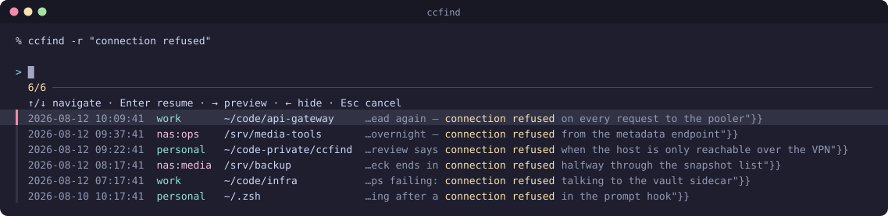
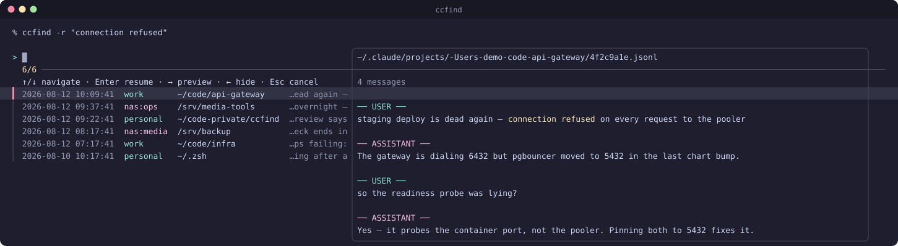
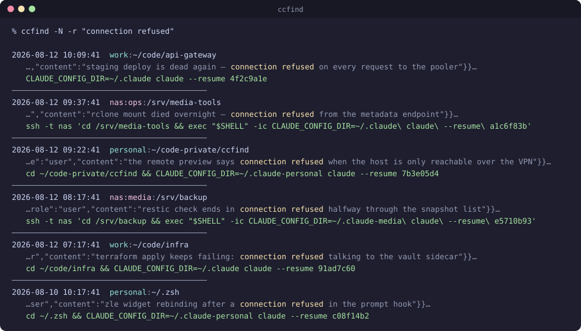
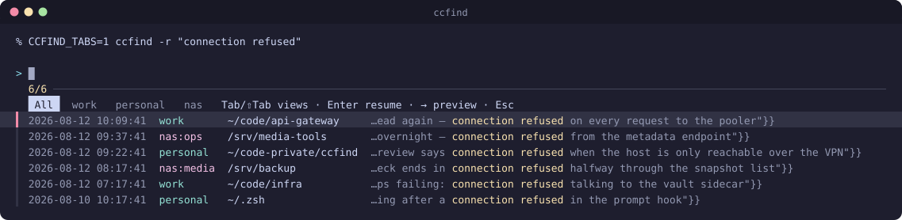

# ccfind

**Fuzzy-find and resume past Claude Code sessions across every directory — with optional multi-host (fleet) and multi-profile search.**

`claude --resume` only lists sessions whose working directory matches the current
dir, so old conversations feel siloed by where you happened to be. In reality every
session is a `.jsonl` transcript under
`~/.claude/projects/<encoded-cwd>/<session-id>.jsonl`. `ccfind` greps the whole tree
(or a chosen subtree), lists matches newest-first, and either drops you into an
`fzf` picker (the default) or prints the exact resume command for each hit.

<div align="center">
  
</div>

## Install

```zsh
git clone <this-repo> ~/ccfind                     # or wherever you keep tools
echo 'source ~/ccfind/ccfind.zsh' >> ~/.zshrc
echo "alias ccfindr='ccfind -r'" >> ~/.zshrc       # optional: remote-search shorthand
exec zsh
```

- **Requires** zsh.
- **Soft dependency: `fzf`** — only the interactive picker uses it; the flat-list
  fallback needs just `grep` / `awk` / `ls`. `brew install fzf` (macOS) /
  `sudo apt install fzf` (Debian/Ubuntu) / <https://github.com/junegunn/fzf#installation>.
- **Preview pane** wants `python3` on PATH (preinstalled on macOS 12+ and Ubuntu
  22.04+); falls back to a raw `tail` of the transcript without it.

Optional per-machine config lives in a gitignored `.env` beside `ccfind.zsh` — copy
`.env.example` to `.env` and fill it in. See **Multi-host** below.

## Usage

```
ccfind <text...>                   # literal, case-insensitive search of all sessions
ccfind -d <dir> <text...>          # only sessions whose cwd is <dir> or below it
ccfind -d . <text...>              # scope to the current directory's subtree
ccfind -x <text...>                # only sessions whose cwd is EXACTLY $PWD (no subdirs)
ccfind -x -d <dir> <text...>       # same, for a directory other than $PWD
ccfind -n <max> <text...>          # cap the number of hits shown (default 10)
ccfind -N <text...>                # force the flat-list output (opt out of the picker)
ccfind -i <text...>                # force the picker on (overrides CCFIND_INTERACTIVE=0 + the TTY check)
ccfind [-d <dir>] [-n <max>]       # no query → just list the most recent sessions
ccfind -r <text...>                # also search the configured remote hosts (CCFIND_HOSTS)
ccfindr <text...>                  # alias for `ccfind -r` (define in ~/.zshrc)
ccfind -H "host-a host-b" <text...># search these ssh hosts (implies remote, overrides CCFIND_HOSTS)
ccfind -l <text...>                # force local only (trumps -r / -H)
ccfind <profile> <text...>         # scope local search to one CCFIND_PROFILES profile
ccfind -p <profile> <text...>      # same, explicit form
ccfind -C <text...>                # no colour (also: NO_COLOR=1, CCFIND_COLOR=never)
ccfind -v <text...>                # note on stderr what each host was searched with
ccfind -j <text...>                # print the hits as JSON (--tsv for the raw records)
```

### Interactive picker (default)

When `fzf` is installed and both stdin and stdout are TTYs, `ccfind` shows an `fzf`
picker of the hits — one aligned line per session: when it was last touched, which
profile or host it belongs to, its working directory, and the matching text with the
search term picked out.

<div align="center">
  
</div>

| Key | Action |
|---|---|
| `↑` / `↓` | Move between hits |
| `Enter` | `cd` to the session's recorded cwd (when different from `$PWD`) and run `claude --resume <id>` in the current shell |
| `→` | Open the **preview pane** — last ~8 user + assistant messages of the highlighted session (text only; tool calls/results reduced to `[tool: <name>]` / `[tool result]`, thinking blocks omitted) |
| `←` | Hide the preview pane again |
| `Esc` | Cancel — no `cd`, no resume |

The `cd` persists because `ccfind` is a function, not a subshell.

`→` opens the session next to the list — the last few messages, with the search
term highlighted where it hit, so you can tell two similar-looking sessions apart
before committing to one. On a remote hit the transcript is fetched over ssh on
demand (once per session, then cached for as long as the picker is open):

<div align="center">
  
</div>

### Flat-list fallback

Each hit prints the session's timestamp + working directory, a snippet centred on
the match, and the resume command (`cd <dir> && claude --resume <id>` when the
session lived elsewhere, so it reloads in its original project context — correct
`CLAUDE.md`, relative paths, git — else just `claude --resume <id>`). You get this
when `fzf` is absent, output is piped (no TTY), you pass `-N`/`--no-interactive`, or
`CCFIND_INTERACTIVE=0` is set.

<div align="center">
  
</div>

```zsh
ccfind "connection refused"      # picker (if fzf+TTY) over the hits
ccfind -d ~/code/myproject       # everything done in that repo, newest first
ccfind -x                        # only sessions started right here, nothing from subdirs
ccfind -n 50 deploy              # show up to 50 hits (same as CCFIND_MAX=50)
ccfind -N deploy                 # flat-list output, copy/paste the resume command
ccfind deploy | less             # auto-flat-list (no TTY on stdout)
```

## Directory scope: `-d` vs `-x`

Both narrow the search to a directory; they differ in whether the directory's
subtree comes along.

| | matches | typical use |
|---|---|---|
| `-d <dir>` | `<dir>` **and every directory below it** | "anything I did in this repo, or any repo under `~/code`" |
| `-x` (`--exact`) | `<dir>` **only** — no subdirectories | "just the sessions started right here" |

`-x` defaults its directory to `$PWD`, so `ccfind -x` needs no `-d`; pass
`-x -d <dir>` to pin another one. Neither flag looks at the files in the
directory — the scope is the working directory a session was *started* in, as
recorded in its transcript.

Why the distinction earns a flag: with `-d`, hits from the directory itself are
**not** separated out. Everything found in the subtree is merged into one list
sorted newest-first, and they all compete for the same `-n` slots (default 10) —
so from `~/code`, a handful of busy sub-repos can push every session started in
`~/code` itself off the end of the list, and the only thing distinguishing them
is the directory column you have to read. `-x` removes them from the search
instead of leaving you to spot them.

`-x` is also the one scope mode that cannot over-match. Claude Code names each
project directory after the session's cwd with every non-alphanumeric character
flattened to `-`, so `~/code` and `~/code-scratch` both encode to
`-Users-me-code…` and a subtree match can't tell a former `/` from a literal
`-`. An exact name has no such ambiguity.

## Colour

Output is coloured when a human is looking at it and plain when anything else is.
The colours carry information rather than decoration:

- the **profile / host label** is cyan for a local profile and magenta for a remote
  host — the one glance that tells you whether `Enter` resumes here or over ssh;
- the **search term** is picked out inside every snippet, in the list, in the picker
  and in the preview pane, so you can see *why* each session matched;
- the **resume command** is green: the line you copy;
- timestamps, separators and the surrounding snippet text are dimmed out of the way.

Colour switches itself off the moment stdout is not a terminal, so
`ccfind foo | grep …`, `> file` and every script that parses the output see exactly
the same bytes they did before. To force the question:

| | |
|---|---|
| `-C` / `--no-color` | plain output for this call, whatever else is set |
| `NO_COLOR=1` | plain, per <https://no-color.org> |
| `CCFIND_COLOR=never` | plain |
| `CCFIND_COLOR=always` | coloured even when piped (what the README images use) |

## Multi-profile search

If you run Claude Code under more than one config dir — e.g. a separate `~/.claude`
and `~/.claude-personal` (`CLAUDE_CONFIG_DIR`) — `ccfind` searches all of them at
once and tags each hit with its profile. A profile is a *directory*: the sessions,
settings and memory live in it, which is why it is the unit ccfind works in. There are two ways to be multi-profile, and both
count:

**1. Tell ccfind** — space/comma-separated `label:configdir` pairs, where
`<configdir>` is the Claude config dir (the one containing a `projects/` subdir).
Order sets the tab order:

```zsh
# .env beside ccfind.zsh  (or export from ~/.zshrc)
typeset CCFIND_PROFILES="work:$HOME/.claude personal:$HOME/.claude-personal"
```

**2. Use [claude-profile](https://github.com/deviationist/claude-profile)** — if it
manages the seats on this machine, it already knows them, and writing them out again
here would be a second copy that drifts. When `CCFIND_PROFILES` is unset, ccfind asks
it (`claude-profile list`, its stable porcelain) and uses what it reports. Nothing to
configure: install both and multi-profile is simply on.

Explicit config wins — set `CCFIND_PROFILES` and claude-profile is not consulted at
all. Either way, a profile is only used if its dir actually exists here, so one
`.env` (or one claude-profile config) shared across a fleet degrades per machine
rather than inventing seats. Neither → a single nameless `~/.claude` profile, exactly
the behaviour before any of this existed.

`ccfind -v` says which of the two it used:

```
ccfind: profiles: claude-profile → work, personal
```

> **Upgrading with claude-profile installed:** searches that used to cover `~/.claude`
> alone now cover every profile it reports, and each hit's resume line pins its own
> `CLAUDE_CONFIG_DIR` — the hit already knows which profile it belongs to.

- **Union by default.** `ccfind foo` searches every configured profile; hits show a
  `work:` / `personal:` column (picker) or prefix (flat list).
- **Scope to one:** a leading label — `ccfind work foo` — or the explicit
  `-p work foo` restricts the local search to that profile. (Flags come before the
  label: `ccfind -N -n 20 work foo`.) The positional form only fires when the first
  word exactly matches a configured label, so ordinary searches are unaffected when
  multi-profile is off.
- **Correct resume.** Resuming a hit runs it under its own profile
  (`CLAUDE_CONFIG_DIR=<that dir> claude --resume <id>`), so a personal session
  reopens in the personal profile regardless of where you launched `ccfind`.
- **Profiles + hosts compose.** With both `CCFIND_PROFILES` and `CCFIND_HOSTS` set,
  `ccfindr foo` searches every local profile *and* every remote host; tabs become
  `All │ work │ personal │ <host>…`. Remote hosts have profiles of their own — see
  **Profiles on remote hosts** below.

## Multi-host search (opt-in per call)

Set `CCFIND_HOSTS` to a space/comma-separated list of ssh aliases — exported in the
environment, or as a `typeset` in the `.env` beside `ccfind.zsh` (see `.env.example`)
— then pass `-r`/`--remote` to fan the same search out to each host's
`~/.claude/projects` in parallel with the local one. Configuring the list alone
changes nothing: plain `ccfind` stays purely local, so you choose the scope on the
fly. The convenient way in is a `~/.zshrc` alias:

```zsh
# .env beside ccfind.zsh
typeset CCFIND_HOSTS="host-a host-b"

# ~/.zshrc
alias ccfindr='ccfind -r'    # ccfind incl. the remote hosts
```

- **The search runs remotely.** A small POSIX worker script is piped over
  `ssh <host> sh -s` (BatchMode, 6 s connect timeout) — nothing is installed on the
  hosts, and only per-hit metadata (id, cwd, mtime, snippet) comes back over the
  wire, never transcript bodies. Each host caps its hits at the same `-n` bound.
- **Merged display.** Remote hits interleave with local ones newest-first. The
  picker gains a host column (`local` / `<host>`); the flat list prefixes the cwd
  with `<host>:`.
- **Resuming a remote hit** runs
  `ssh -t <host> 'cd <cwd> && exec "$SHELL" -ic claude\ --resume\ <id>'` — the
  interactive shell is deliberate: non-interactive ssh PATH usually lacks `claude`,
  and the interactive rc also loads any `claude`-wrapper you have. The flat list
  prints that exact command, copy/paste-ready.
- **Remote preview** (`→` in the picker) fetches the highlighted transcript over ssh
  once into a per-invocation cache, then reuses it while you toggle the preview.
- **Per-call control:** `-r` opts in using the configured list; `-H "<hosts>"`
  searches an explicit list (implies remote, no `-r` needed); `-l`/`--local` forces
  local and trumps both. Host-list precedence: `-H` > exported `CCFIND_HOSTS` >
  `.env`. `-r` with no list configured warns on stderr and searches locally.
- **Failure is soft:** an unreachable host prints one
  `ccfind: remote search failed on: <host>` line to stderr and the rest still show.
- **`-d <dir>` / `-x` scoping** applies to the remotes too, but the path is resolved
  *locally* and matched as-is on each host — useful when the path exists on the
  hosts, a no-op filter otherwise. A host running a ccfind too old to know `-x`
  still narrows correctly: it declines the flag, and the worker's built-in
  fallback search applies the exact scope itself.

### Profiles on remote hosts

A remote host can have several Claude profiles too, and only that host knows what
they are. So when the worker lands, it looks for a ccfind **on that host** and asks
it, instead of guessing:

- **Host has ccfind** → the worker runs `ccfind --tsv -l` there. That reads the
  host's *own* `.env`, so its profiles are searched under its own labels, and hits
  come back tagged `<host>:<profile>` (`nas:media`). Resuming one runs
  `CLAUDE_CONFIG_DIR=<that host's dir> claude --resume …` over ssh, so it reopens in
  the right seat on the far end.
- **Host has no ccfind** → the worker walks `~/.claude/projects` exactly as it always
  did. That host contributes its **default profile only**; any other seat on it is
  invisible. This is a quiet fallback, not an error — `-v` reports it:

  ```
  ccfind: nas — no usable ccfind (not-installed); searched ~/.claude only,
          so any other profile on that host is invisible
  ```

Both happen in a single connection — the worker tries ccfind and falls back inline,
so nothing costs an extra round trip. An older ccfind that doesn't understand
`--tsv` exits non-zero and lands in the same fallback, so a fleet mid-upgrade
degrades rather than breaking.

ccfind is looked for at `$CCFIND_REMOTE_PATH`, then `~/ccfind/ccfind.zsh`,
`~/.zsh/ccfind/ccfind.zsh`, `~/.config/ccfind/ccfind.zsh` — **every** candidate is
tried until one answers, so a stale clone left at an old location can't shadow the
current one. A host only reports itself incompatible when none of them worked.
`command -v` is no use here — ccfind is a shell *function*, invisible to the
non-interactive shell the worker runs in — so it is the file that is looked for.

**Both ways of being multi-profile work out there**, because the host runs its own
ccfind and answers for itself: its `.env`, or its claude-profile (looked for at
`~/claude-profile/claude-profile.py`, `~/.zsh/…`, `~/.config/…`, or
`CCFIND_PROFILE_PATH` in its own `.env`). What will *not* work is an export in that
host's `~/.zshrc` — the worker deliberately runs `zsh -f`, skipping rc files, and
drops any `CCFIND_*` that leaked from the caller so the host's own config is the only
one in play.

## Machine-readable output

`-j`/`--json` prints the hits as one JSON document instead of a list:

```zsh
ccfind --json "connection refused" | jq -r '.results[] | "\(.host)\t\(.cwd)"'
```

```json
{
  "version": 1,
  "query": "connection refused",
  "scope": "",
  "scope_exact": false,
  "total": 6,
  "shown": 6,
  "truncated": false,
  "results": [
    {
      "epoch": 1786520941, "host": "nas", "profile": "media",
      "config_dir": "/home/you/.claude-media", "id": "e5710b93",
      "cwd": "/srv/backup", "mtime": "2026-08-12 08:17:41",
      "snippet": "…", "path": "/home/you/.claude-media/projects/-srv-backup/e5710b93.jsonl"
    }
  ]
}
```

`scope` is the resolved `-d` directory (empty when unscoped) and `scope_exact` says
whether `-x` restricted it to that directory alone. `host` is `local` or the ssh
alias; `profile` is empty on a machine with no profiles
configured; `config_dir` is the dir that hit belongs to, *on that machine*, which is
what a consumer needs to resume it into the right seat. The document is well-formed
even when nothing matched (`"results": []`) — and JSON output never opens the picker
and is never coloured, whatever else is set.

`--tsv` prints the same records tab-separated, one per line, without the `host`
column: `epoch, profile, config_dir, id, cwd, mtime, snippet, path`. That is the
format ccfind speaks to itself over ssh (see **Profiles on remote hosts**), and it
is stable enough to script against — no escaping to undo, since tabs and control
characters are stripped from snippets.

### Custom remote resume (tmux, screen, mosh, …)

By default, resuming a remote hit runs
`ssh -t <host> 'cd <cwd> && exec "$SHELL" -ic claude --resume <id>'`. Set
`CCFIND_REMOTE_RESUME` to your own command or function and ccfind calls it as

```
<CCFIND_REMOTE_RESUME> <host> <cwd> <session-id>
```

instead — you own the connection. The common use is to land the remote session
inside a persistent multiplexer so a dropped link doesn't kill it. For example, a
function that ssh's in and attaches-or-creates a per-session tmux:

```zsh
# in ~/.zshrc (or a sourced file); then set CCFIND_REMOTE_RESUME=claude-ssh-tmux
claude-ssh-tmux() {
  local host=$1 cwd=$2 id=$3
  # tmux new-session -A attaches an existing session or creates it — so
  # reconnecting and resuming the same id re-attaches the live session.
  ssh -t "$host" tmux new-session -A -s "ccfind-$id" \
    "cd ${(q)cwd} && exec claude --resume $id"
}
```

ccfind stays agnostic — it knows nothing about tmux/screen, it just calls your
hook. The flat list prints the same `<cmd> <host> <cwd> <id>` invocation, so it's
copy/paste-able too.

### Per-host tab views (`CCFIND_TABS=1`)

fzf has no native tab widget, so this emulates one: with `CCFIND_TABS=1` set (env or
`.env`, next to `CCFIND_HOSTS`), the multi-host/multi-profile picker grows a tab bar
in the header — e.g. `All │ work │ personal │ host-a` — and `Tab` / `Shift-Tab` cycle
the views (current tab inverse-video, `All` first, empty views omitted). Each tab shows
**that host's own newest hits, up to `-n <max>`** — so a host whose sessions are all
older than the global top-`max` still gets a full tab. Needs **fzf ≥ 0.45** (Jan
2024); older fzf silently gets the plain merged list. No effect on the flat list,
local-only runs, or when `CCFIND_TABS` is unset.

<div align="center">
  
</div>

## Notes

- **Sort order:** newest first, by the transcript file's last-modified time
  (`ls -t`) — most recently active session first. Resuming a session appends to its
  file, so it pops back to the top.
- Search is a **literal substring** (not regex), case-insensitive.
- The encoded project-dir name is lossy (every `/` becomes `-`), so the displayed
  working directory is read from the `cwd` field *inside* each transcript (exact).
- `CCFIND_MAX` caps how many results are printed / pickable (default 10; `-n <max>`
  overrides per-call). `CCFIND_INTERACTIVE` (default `1`) controls picker-vs-flat-list.
- Works the same on macOS and Linux; the only platform-conditional bit is the `fzf`
  install path.

## Environment variables

| Variable | Default | Purpose |
|---|---|---|
| `CCFIND_PROFILES` | *(unset)* | Space/comma-separated `label:configdir` pairs → search multiple local Claude profiles. Unset = just `~/.claude`. |
| `CCFIND_HOSTS` | *(unset)* | Space/comma-separated ssh aliases for `-r`/`ccfindr`. Env or `.env`. |
| `CCFIND_REMOTE_RESUME` | *(unset)* | Command/function to resume a remote hit: called as `<cmd> <host> <cwd> <id>` instead of the built-in ssh (wrap in tmux/screen, etc.). |
| `CCFIND_REMOTE_PATH` | *(unset)* | Where ccfind lives on the remote hosts, if not one of the conventional paths. Enables remote multi-profile. |
| `CCFIND_PROFILE_PATH` | *(unset)* | Where `claude-profile.py` lives, if not one of the conventional paths. Only consulted when `CCFIND_PROFILES` is unset. |
| `CCFIND_PROFILE_CMD` | *(unset)* | Command to ask for the profile list instead of `claude-profile` (called as `<cmd> list`, expecting `label<TAB>dir` lines). |
| `CCFIND_TABS` | *(unset)* | `1` → per-host tab views in the multi-host picker (fzf ≥ 0.45). |
| `CCFIND_MAX` | `10` | Max hits printed / pickable. `-n <max>` overrides per-call. |
| `CCFIND_INTERACTIVE` | `1` | `0` → default to the flat list instead of the fzf picker. |
| `CCFIND_COLOR` | `auto` | `always` / `never` override the "colour only on a terminal" default. `NO_COLOR` and `-C` also force plain. |

## Assets

The README images are regenerated by:

```sh
zsh tools/generate-readme-svg.zsh    # → assets/{demo,picker,preview,tabs,list}-<hash>.svg + README refs
zsh tools/generate-readme-svg.zsh /tmp/out   # fixed names elsewhere, README untouched
```

It builds a hermetic sandbox — a fake `$HOME` with two seeded Claude profiles, a
stub `ssh` standing in for the remote host, and a stub `fzf` that records the rows
the real picker is handed — and runs ccfind **unmodified** with
`CCFIND_COLOR=always`. The text in the images is therefore genuine output; only the
window chrome and fzf's own furniture are drawn. It runs against a copy of
`ccfind.zsh`, so your own `.env` never leaks into an image.

`demo.svg` is the same material on a CSS keyframe timeline — an SVG in an ``
renders with scripting disabled but declarative animation live, which is what makes
it work on GitHub. The four stills cover the same ground for anything that doesn't
animate, and `prefers-reduced-motion` freezes the demo on its final frame.

Rerun it whenever the picker layout, the flat list or the colours change, and commit
the SVGs together with the README, whose `` refs it rewrites (the hash in each
filename busts GitHub's image cache).

## License

MIT — see [LICENSE](LICENSE).
